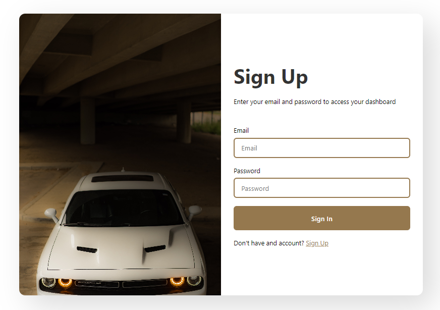

# Demo Link [bootcampproject1.netlify.app](https://bootcampproject1.netlify.app/)

# Sign In Page Documentation

## Introduction

This document provides an easy-to-understand explanation of a web page designed for signing in to a special place on the internet. This web page helps you get access to something cool using your email and a secret password.

## Web Page Components

### Title

The **Title** of the web page tells us what the page is all about. This page is called "Sign In," which means it's where you can say "Hi!" to a special online place.

### Styles

The web page uses a **Stylesheet** to make everything look nice. It's like picking out cool clothes for the web page to wear. The clothes make sure the page looks good on all sorts of screens.

### Card

Imagine the web page as a card with two sides, just like a playing card. One side is the **left** and the other is the **right**. They work together to show us the sign-in stuff.

### Sign Up Form

On the **right side** of the card, there's a **form** where you can do some cool things:

#### Heading

At the very top, there's a **big title** that says "Sign Up." It's like a welcome sign when you visit a new place.

#### Subheading

Under the big title, there's a smaller sentence that says you need an email and a secret password to go in. It's like a password hint!

#### Email Input

There's a special spot where you can type your **email**. It's like writing down your name on a visitor list. The web page wants to know who you are.

#### Password Input

Next, there's another special spot where you can type your **password**. This is a secret code that only you should know. It's like the key to your room.
****
#### Sign In Button

When you're ready, there's a **button** that says "Sign In." It's like knocking on the door to the special place. If your email and password are correct, the door will open!

#### Sign Up Link

At the end of the form, there's a sentence that says if you don't have an account, you can click on a link to **Sign Up**. It's like saying, "Hey, if you're new here, you can join too!"

## Conclusion

# HTML Instructions

So, this web page is like a magical door that opens when you have the right email and password. It's a fun way to visit a special online place. Just remember, always keep your password safe and don't share it with anyone! If you're new, you can also use the link to create an account. Have fun exploring! 🚪🌟

Sure, here's a step-by-step guide on how to write the HTML code for the "Sign In" web page:

**Step 1: Set Up the Basic Structure**

Start by creating a new file and naming it something like "signin.html". This is where your HTML code will go. Then, open the file in a text editor or an integrated development environment (IDE).

```html
<!DOCTYPE html>
<html lang="en">

<head>
    <meta charset="UTF-8">
    <meta name="viewport" content="width=device-width, initial-scale=1.0">
    <title>Sign In</title>
    <link rel="stylesheet" href="./style.css">
</head>

<body>

</body>

</html>
```

**Step 2: Create the Card Structure**

Inside the `<body>` tags, you'll build the card structure. This card will have a left side and a right side. The left side will be empty for now, and the right side will contain the form.

```html
<div class="card">
    <div class="left"></div>
    <div class="right">
        <!-- Form will go here -->
    </div>
</div>
```

**Step 3: Add the Form**

Inside the `<div class="right">` tags, you'll create the form for signing in. This form will have a heading, subheading, input fields for email and password, a sign-in button, and a link to sign up.

```html
<div class="form">
    <h1 class="headingText">Sign Up</h1>
    <p class="subheadingText">Enter your email and password to access your dashboard</p>

    <div class="inputView">
        <p class="label">Email</p>
        <input type="email" class="input" placeholder="Email">
    </div>

    <div class="inputView">
        <p class="label">Password</p>
        <input type="password" class="input" placeholder="Password">
    </div>

    <button>Sign In</button>

    <p class="lastText">Don't have an account? <a href="/signup.html">Sign Up</a></p>
</div>
```

**Step 4: Save and Test**

Once you've written the HTML code, save the file. You can now open the "index.html" file in a web browser to see how your web page looks and works. Remember, this is just the HTML structure. To make it look nice, you can create a "style.css" file and link it in the `<head>` section of your HTML.

This step-by-step guide covers the basic HTML structure for the "Sign In" web page. You can later add more styles and interactivity using CSS and JavaScript to enhance the user experience.

# CSS Instructions
**Step 1: General Styling**

The first part of the CSS styles sets up some general rules for the entire page. It ensures that all elements have the same box-sizing behavior, a consistent font-family, and removes any default margins and padding.

```css
* {
  box-sizing: border-box;
  font-family: system-ui, -apple-system, BlinkMacSystemFont, "Segoe UI", Roboto, Oxygen, Ubuntu, Cantarell, "Open Sans", "Helvetica Neue", sans-serif;
  margin: 0;
  padding: 0;
}
```

**Step 2: Body Styling**

These styles set up the overall appearance of the page's body, centering its content both horizontally and vertically. It also sets the height of the body to fill the entire viewport.

```css
body {
  display: flex;
  justify-content: center;
  align-items: center;
  height: 100vh;
}
```

**Step 3: Card Styling**

These styles define the appearance of the card that contains the sign-in form. It creates a box with rounded corners and a subtle shadow. The card is split into two halves for desktop and stacked on top of each other for smaller screens.

```css
.card {
  display: flex;
  justify-content: space-between;
  align-items: center;
  width: 800px;
  max-width: 98%;
  height: 90vh;
  border-radius: 12px;
  overflow: hidden;
  background: #ffffff;
  box-shadow: 20px 20px 60px #d9d9d9, -20px -20px 60px #ffffff;
}
@media (max-width: 768px) {
  .card {
    flex-direction: column;
    justify-content: flex-start;
    align-items: center;
    width: 98%;
  }
}
```

**Step 4: Left Side Styling**

Styles for the left side of the card, which includes a background image that covers the entire area.

```css
.left {
  width: 50%;
  height: 100%;
  background-image: url(./bg.jpg);
  background-size: cover;
  background-repeat: no-repeat;
}
@media (max-width: 768px) {
  .left {
    height: 3rem;
    width: 90%;
  }
}
```

**Step 5: Right Side Styling**

Styles for the right side of the card, which contains the form. It aligns the form elements vertically in the center.

```css
.right {
  width: 50%;
  height: 100%;
  display: flex;
  flex-direction: column;
  justify-content: center;
  align-items: center;
}
@media (max-width: 768px) {
  .right {
    width: 90%;
  }
}
```

**Step 6: Form Styling**

Styles for the form elements inside the right side of the card. This includes the heading, subheading, input fields, sign-in button, and sign-up link.

```css
.form {
  width: 350px;
  max-width: 90%;
}
@media (max-width: 768px) {
  .form {
    width: 100%;
  }
}
```

And so on... continue following the comments in the provided CSS code to understand and apply the different styles to various parts of the web page.

Remember, each section of the CSS code corresponds to a specific element or group of elements on the page. By combining these styles, you create the visual appearance and layout of the "Sign In" web page.